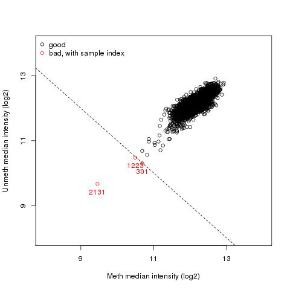
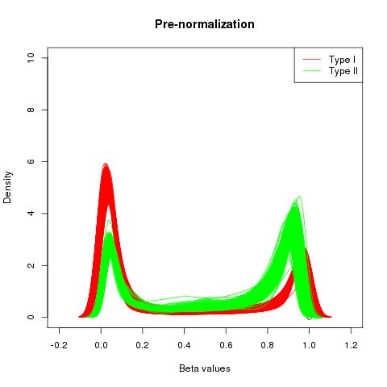
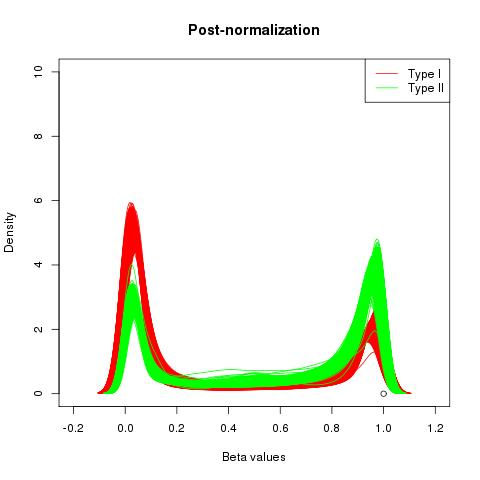
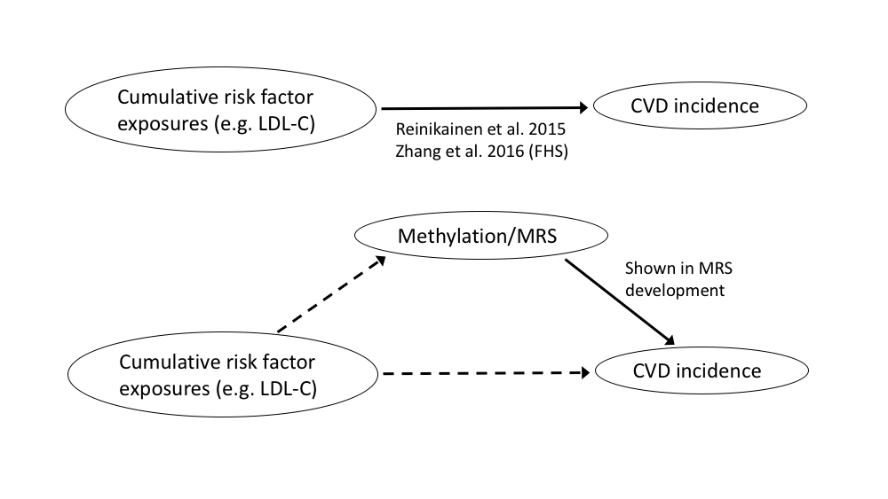

```{r prereqs, include=F}
library(tidyverse)
library(knitr)
opts_chunk$set(echo=F, cache=T, cache.path="../cache/", fig.path="../cache/")
```

\newpage
# Methylation data

## Datasets
* FHS Offspring in use (dbGaP request likely to be accepted within days)
* Normative Aging Study -- in discussion with Joel Schwartz about obtaining the data 
* Lothian Birth Cohorts -- pending, may be available soon

## Preprocessing
* Read in raw .idat intensity files using the minfi package
* Sample QC 
    + Mismatch between predicted and reported sex
    + Failed samples with low intensity 

```{r QC-plot, out.width="60%", fig.align="center"}

```
\newpage

* BMIQ within-array normalization (Teschendorff et al. 2013) for Type I/II bias

```{r norm-plots, fig.show="hold", out.width="50%"}


```

* Probe filtering to remove:
    + Probes in sex chromosomes
    + Cross-reactive probes (identified in Chen et al. 2013) 
    + Probes measuring SNPs
    + Probes with SNPs at CpG site or single-base extension site
    + Probes measuring CpH (non-CpG) sites
* Methylation-based covariates: Various potential covariates were calculated from the methylation data, including PCA (based on the 50k most variable probes), PCA on control probes (Lehne 2015), SVA, and ReFACTor.

Correlations of the top PCs with basic covariates:

```{r pca-correlations, fig.align="center", out.width="75%"}
load("../int/nonMethData.RData")
pcaData <- select(nonMethData, one_of(paste0("PC",1:10)), age, sex, bmi, smoking_now,
                  CD8T, CD4T, NK, Bcell, Mono, Gran)
cors <- cor(pcaData, use="pairwise.complete.obs")
cors[cors==1] <- 0
corsDF <- data.frame(cors) %>%
  rownames_to_column(var="var1") %>%
  gather(key=var2, value=correlation, -var1) %>%
  mutate(var1=factor(var1, levels=names(pcaData)), var2=factor(var2, levels=rev(names(pcaData)))) %>%
  filter(!grepl("PC", var1), grepl("PC", var2))
ggplot(corsDF, aes(x=var1, y=var2, fill=correlation)) +
  geom_tile(color="white") +
  scale_fill_gradient2(low='#0000FF',mid='#ffffbf',high='#FF0000') +
  scale_x_discrete(position="top") +
  theme(axis.title=element_blank(), axis.text.x=element_text(angle=30))
```

# Subject metadata

```{r metadata}
load("../int/nonMethData.RData")
withCVD <- which(nonMethData$event)
```

## Population
* Have samples from `r nrow(nonMethData)` unique individuals in the dataset after sample QC
* Most subjects are between 50 and 80 years old
* Approximately equal sex distribution

## Cardiovascular events
CVD events were broadly defined as MI, stroke, or death from CHD/CVD.  `r length(withCVD)` individuals experienced an event between Exam 8 and the available ~3600 days of follow-up. Further characterization of this subgroup:

* `r sum(nonMethData$sex[withCVD]==1, na.rm=T)` males, `r sum(nonMethData$sex[withCVD]==2, na.rm=T)` females
* Very few (`r sum(nonMethData$smoking_now[withCVD], na.rm=T)`) smoke
<!-- Note: below is manually inputted-->
* About 100 of these had experienced a previous cardiovascular event.

# Basic EWAS
A genome-wide scan was performed using methylation M-values ($=log_2\left(\frac{intensity_{methylated}}{intensity_{unmethylated}}\right)=logit(\beta)$) to predict time to CVD event using Cox models. Covariates included age, sex, BMI, blood cell count as estimated by the method of Houseman et al. 2012, and the top 20 PCs.

## Inflation
Some level of inflation was seen in the overall p-value distribution, using a random subset of 50k probes. Inflation levels were tested across different combinations of the methylation-based covariates mentioned above, and the best performance was seen with a combination of cell counts and principal components, so these covariates were taken forward.

```{r ewas, include=F}
load("../int/ewasRes.RData")
ewasRes <- data.frame(res[[1]], stringsAsFactors=F) %>%
  mutate(p=as.numeric(Pr...z..)) %>%
  select(CpG, p)

make_qqplot <- function(pVec, plotTitle="Title") {
  pVec <- pVec[!is.na(pVec)]
  qqplot(-log10(1:length(pVec)/length(pVec)), -log10(pVec), pch=".", main=plotTitle, xlab="Expected (-logP)", ylab="Observed (-logP)")
  abline(0,1,col="red")
}
gControl <- function(pVals) {
# See van Iterson 2017 methods and/or Lehne 2015 code for details on genomic control for EWAS
# Below is modeled after Lehne 2015
lambda <- median(qchisq(pVals, df=1, lower.tail=F), na.rm=T)/qchisq(0.5, df=1)
round(lambda, 2)
}
```

These covariates led to an observed genomic inflation factor $\lambda$ of `r gControl(ewasRes$p)` in the full EWAS.

```{r ewas-qqplot, fig.align="center", out.width="60%"}
make_qqplot(ewasRes$p, "Main Cox-regression based EWAS")
```

On Dawn's suggestion, continuous outcomes were also tested using the same set of covariates to understand whether the binary nature of the Cox analysis was contributing to the inflation.

```{r continuous-inflation, fig.show="hold", out.width="50%"}
contRes <- {load("../output/20170717_qqExplore/ewasRes_IMT.RData"); res}
pVecs <- lapply(contRes, function(x) as.numeric(x[,3]))
make_qqplot(pVecs$glu_WBC, "Glucose")
make_qqplot(pVecs$imt, "IMT")
```

Left: blood glucose as outcome ($\lambda$=`r gControl(pVecs$glu_WBC)`), right: mean intima-media thickness (from Exam 6) as outcome ($\lambda$=`r gControl(pVecs$imt)`)

The notable inflation reduction with alternate outcomes (despite the same covariates) suggests that either the binary/Cox outcome is somehow the source of the inflated p-values, or there really is a relationship across a significant portion of the genome.

## Biological significance of EWAS hits

```{r FDR-CpGs, warning=F}
ewasRes$FDR <- p.adjust(ewasRes$p, "BH")
fdr_thresh <- 0.05
FDR_CpGs <- na.omit(ewasRes$CpG[ewasRes$FDR<fdr_thresh])

suppressMessages(library(IlluminaHumanMethylation450kanno.ilmn12.hg19, quietly=T))
cpgSet_anno <- cbind(Locations[FDR_CpGs,], Other[FDR_CpGs,], Islands.UCSC[FDR_CpGs,]) %>%
  data.frame(stringsAsFactors=F) %>%
  rownames_to_column(var="cpg")
```

`r length(FDR_CpGs)` CpG sites are significantly associated with incident CVD at an FDR of `r fdr_thresh`, annotated to `r length(unique(unlist(strsplit(cpgSet_anno$UCSC_RefGene_Name, ";"))))` unique genes.

### Results from a gene set enrichment analysis (simple hypergeometric test) of these genes

```{r gsea, results="asis"}
## Enrichment analysis
msigdb_file <- file("../data/misc/gsea/c2.cp.v6.0.symbols.gmt")  # MSigDB file from http://software.broadinstitute.org/gsea/msigdb/collections.jsp#C2
msigdb <- strsplit(readLines(msigdb_file), split="\t")  # File is tab-separated with gene lists immediately following their names and URLs
names(msigdb) <- purrr::map(msigdb, 1)  # First element of each msig vector is name
msigdb <- purrr::map(msigdb, function(sig) sig[-c(1,2)])  # No need for name or URL
totalNumAnnotatedGenes <- length(unique(unlist(strsplit(Other$UCSC_RefGene_Name, split=";"))))
run_HGtest <- function(msig, mygeneset, N) {
  numHits <- sum(mygeneset %in% msig)
  numMsig <- length(msig)
  numNonMsig <- N - numMsig
  numDrawn <- length(mygeneset)
  phyper(numHits, numMsig, numNonMsig, numDrawn)
}
enrichment_res <- lapply(msigdb, run_HGtest, cpgSet_anno$UCSC_RefGene_Name, totalNumAnnotatedGenes)
enrich_tbl <- data.frame(Category=names(enrichment_res), 
                         p.value=unname(unlist(enrichment_res))) %>%
  mutate(FDR=p.adjust(p.value, method="BH")) %>%
  arrange(p.value)
kable(head(enrich_tbl, 15), digits=3)
# pandoc.table(head(enrich_tbl, 15), digits=3, justify="left", split.cells=40, use.hyphening=T)
```

\newpage
### Genomic location of these CpGs with respect to genes and CpG islands:

```{r cpg-locs, fig.show="hold", out.width="50%"}
annot <- rownames_to_column(data.frame(cbind(Other, Islands.UCSC), stringsAsFactors=F), var="cpg")

summarise_annotation <- function(group, df) {
  # Takes in a set of annotations and returns the proportions of a given field (e.g. gene name)
  df %>%
    select(one_of("cpg", group)) %>%
    separate_rows(group, sep=";") %>%
    distinct() %>%
    filter_at(group, all_vars(.!="")) %>%
    group_by_at(group) %>%
    summarise(n=n()) %>%
    mutate(frac=n/sum(n))
}

annot_plot <- function(group_var, subset_annot, full_annot) {
  # Given a specific field, plot proportion of CpGs in a specific subset next to those of the full set
  my_groups <- summarise_annotation(group_var, subset_annot)
  all_groups <- summarise_annotation(group_var, full_annot)
  merge_groups <- inner_join(my_groups, all_groups, by=group_var, suffix=c(".subset",".all")) %>%
    gather(key=group, value=frac, contains("frac")) %>%
    mutate(group=factor(group, levels=c("frac.all","frac.subset"), labels=c("All CpGs","EWAS hits")))
  ggplot(merge_groups, aes_string(x=group_var, y="frac", fill="group")) +
    geom_bar(stat="identity", position="dodge") +
    theme(axis.title=element_blank())
}

annot_plot("UCSC_RefGene_Group", cpgSet_anno, annot)
annot_plot("Relation_to_Island", cpgSet_anno, annot)
```

# Methylation risk score
Based on the very high-dimensional dataset and existing precedents for similar methylation-based biomarkers (e.g. Horvath DNAm age), a penalized regression approach (elastic net) was applied to the basic Cox model to develop the MRS, using the same covariates as in the EWAS, i.e. *CVD events ~ sex + age + smoking status + WBC counts + 20 PCs + >400k CpGs*.  Specifically, all non-zero coefficients from the main regression that corresponded to CpG sites were used in the added sum of methylation M-values that constitutes the MRS. 

## Cross-validation and stability analysis
```{r repCV}
load("../int/testMRS_repCV_res.RData")

coefs <- purrr::map(allRes, "components")  # Extracts list of CpGs with associated coefficients
cpgs <- purrr::map(coefs, names)  # CpG names only
mean_num_cpgs <- round(mean(unlist(lapply(cpgs, length))))  # Distribution of # of CpGs selected
specific_cpg_dist <- as.vector(table(unlist(cpgs)))  # How consistently do the same CpGs show up across random 50% training set splits?
```

Given the current lack of a validation dataset, repeated cross-validation was performed by training the MRS model on a random 50% of the dataset (balanced for total incident CVD events) followed by testing the predictivity of the model on the remaining 50% using a Cox model adjusted for calculated Framingham Risk Score (D'Agostino et al. 2008), for a total of `r length(allRes)` iterations.

```{r CV-plots, fig.show="hold", out.width="50%"}
pVals <- purrr::map(allRes, function(x) x$res[,"Pr(>|z|)"])
pValsDF <- data.frame(t(data.frame(pVals)))
ggplot(data=pValsDF, aes(x=mrs, y=frs)) + 
  geom_point() + 
  geom_vline(xintercept=0.05, linetype=2, alpha=0.25) +
  geom_hline(yintercept=0.05, linetype=2, alpha=0.25) +
  scale_x_log10() + scale_y_log10() +
  xlab("MRS p-value") + ylab("FRS p-value") +
  ggtitle("P-values from repeated CV") +
  theme(plot.background=element_rect(size=1, linetype=1, color="black"))

load("../int/mrsData.RData")  # To retrieve SDs for MRS and FRS
source("helpers.R")  # Contains FRS calculation script
mrsData$frs <- calc_FRS(dplyr::rename(mrsData, TOT_CHOL=chol, HDL_CHOL=hdl, SBP=sysBP))

coefs <- purrr::map(allRes, function(x) x$res[,"coef"])
HRs_per_mad <- data.frame(t(data.frame(coefs))) %>%
  mutate(mrs_hr_per_mad=exp(sd(mrsData$mrs_full, na.rm=T) * mrs),
         frs_hr_per_mad=exp(sd(mrsData$frs, na.rm=T) * frs))

ggplot(data=HRs_per_mad, aes(x=mrs_hr_per_mad, y=frs_hr_per_mad)) + 
  geom_point() + 
  xlab("HR per MAD for MRS") + ylab("HR per MAD for FRS") +
  ggtitle("Hazard ratio estimates from repeated CV") +
  theme(plot.background=element_rect(size=1, linetype=1, color="black"))
```

The above plots show result summaries across the `r length(allRes)` repetitions. Left: p-values, right: estimated hazard ratios per median average deviation difference in MRS value. MAD is used in place of SD due to the heavy tails in the MRS distribution.

An average of `r mean_num_cpgs` CpG sites are selected per iteration. Many of the CpG sites are chosen in only one of the iterations (`r sum(specific_cpg_dist==1)` of `r length(unlist(cpgs))` total). However, a smaller number appear somewhat consistently, with `r sum(specific_cpg_dist>10)` showing up more than half the time.

## Distribution

Though the specific units are arbitrary, the MRS distribution has more extreme values/heavier tails than the set of Framingham Risk Scores in this dataset.

```{r risk-score-distributions, fig.show="hold", out.width="50%", message=F, warning=F}
ggplot(mrsData, aes(x=frs)) + geom_histogram() + ggtitle("FRS distribution")
ggplot(mrsData, aes(x=mrs_full)) + geom_histogram() + ggtitle("MRS distribution")
```


## Association with cardiovascular risk factors

```{r mrs-correlations, fig.align="center", fig.width=2, fig.height=3, out.width="60%"}
bms <- c("sex","age","bmi","sysBP","chol","hdl","tg","glu","frs")
cors <- sapply(bms, function(bm) cor(mrsData$mrs_full, mrsData[[bm]], use="pairwise.complete.obs"))
cor_df <- rownames_to_column(data.frame(cor=cors), var="variable") %>%
  mutate(variable=factor(variable, levels=rev(variable)))
ggplot(cor_df, aes(x="Correlation with MRS", y=variable, fill=cor)) + 
  geom_tile(color="white") +
  scale_fill_gradient2(low='#0000FF',mid='#ffffbf',high='#FF0000') +
  theme(axis.title=element_blank())
```


## Association with cumulative risk factor exposure

One central question that informed the formulation of my research strategy was whether a CVD MRS would in any sense act as a record of past exposures to risk factors such as blood lipid levels. To investigate this question, laboratory results were retrieved for FHS Offspring participants in exams 1-7 and the following values were established for a series of biomarkers:

* "Cumulative" = mean value over exams 1-7 (~ 35 yrs.)
* "Recent" = mean value over only the more recent exams 5-7 (~ 15 yrs.)
* "Current" = value from Exam 8

```{r cumulative, fig.align="center", out.width="80%"}


library(readxl)
fram_lipid_varNames <- data.frame(exam=1:7,
                                  chol=c("A9","B352","C429","D448","E667","F726","G704"),
                                  hdl=c("A10","B355","C431","D449","E668","F725","G703"),
                                  ldl=c("A12","B357","C442",NA,NA,NA,NA),
                                  tg=c("A13","B358","C433","D451","E670","F727","G706"),
                                  glu=c("A31","B737","C434","D452","E671","F724","G705"),
                                  sysBP=c("A55","B24","C184","D192","E485","F476","G271"))

exams <- apply(fram_lipid_varNames, 1, function(row) {
  fileName <- grep(paste0("c1\\.ex1_", row["exam"]), list.files("../data/phenotypes/"), value=T)
  phenDF <- read_excel(paste0("../data/phenotypes/", fileName), sheet=2)
  cols <- c(shareid="shareid", na.omit(row)[-1])
  setNames(phenDF[cols], names(cols))
})
names(exams) <- paste0("exam", 1:7)
allExams <- bind_rows(exams, .id="exam") %>%
  mutate(nonHDL=chol-hdl)
cumVals <- allExams %>%
  group_by(shareid) %>%
  summarise_at(vars(-exam), mean)
names(cumVals)[-1] <- paste0(names(cumVals)[-1], "_cum")
recentVals <- allExams %>%
  filter(exam %in% paste0("exam", 5:7)) %>%
    group_by(shareid) %>%
  summarise_at(vars(-exam), mean)
names(recentVals)[-1] <- paste0(names(recentVals)[-1], "_recent")

allCumVals <- inner_join(cumVals, recentVals, by="shareid")

cumData <- inner_join(mrsData, allCumVals, by="shareid")
```

First, do the cumulative exposures have any additive explanatory power beyond current exposure levels (in full dataset) in predicting cardiovascular events? Heatmap represents z-scores from the relevant Cox models. 

```{r cumulative-to-CVD, fig.align="center", out.width="80%"}
library(survival)
bmFields <- data.frame(recent=c("HDL_CHOL","TOT_CHOL","TRIG","GLUCOSE","SBP"), 
                       cum=c("hdl_cum","chol_cum","tg_cum","glu_cum","sysBP_cum"))
cvdData <- inner_join(cumData, distinct(select(nonMethData, shareid, timeToEvent, event), 
                                        shareid, .keep_all=T), by="shareid")
CVD_model <- function(predictors, bm, dat) {
    cox.fit <- coxph(as.formula(paste0("Surv(time=dat$timeToEvent, event=dat$event)~",predictors)), data=dat)
    summary(cox.fit)$coef[bm,'z']
}
cum_to_CVD <- sapply(c("sysBP","chol","hdl","tg","glu"), function(bm) {
  cum <- CVD_model(paste0(bm, "_cum"), paste0(bm, "_cum"), cvdData)
  recent <- CVD_model(paste0(bm, "_recent"), paste0(bm, "_recent"), cvdData)
  current <- CVD_model(bm, bm, cvdData)
  c(cum, recent, current)
})
plotDF <- rownames_to_column(data.frame(t(cum_to_CVD))) %>%
  setNames(c("biomarker","Cumulative","Recent","Current")) %>%
  gather(key=model, value=zScore, 2:4, factor_key=T)
ggplot(plotDF, aes(x=model, y=biomarker, fill=zScore)) + 
  geom_tile(color="white") + 
  scale_fill_gradient2(low='#0000FF',mid='#ffffbf',high='#FF0000') +
  scale_x_discrete(position="top") +
  theme(axis.title=element_blank())
```

Next, do the calculated methylation risk scores have an independent association with cumulative biomarker levels (in full dataset)? Heatmap represents t-scores from the relevant linear model predicting MRS from risk factor levels. 

```{r cumulative-to-MRS, fig.align="center", out.width="80%"}
MRS_model <- function(predictors, bm, dat)
  summary(lm(as.formula(paste0("mrs_full~",predictors)), data=dat))$coef[bm,"t value"]
cum_to_MRS <- sapply(c("sysBP","chol","hdl","tg","glu"), function(bm) {
  cum <- MRS_model(paste0(bm, "_cum"), paste0(bm, "_cum"), cvdData)
  recent <- MRS_model(paste0(bm, "_recent"), paste0(bm, "_recent"), cvdData)
  current <- MRS_model(bm, bm, cvdData)
  c(cum, recent, current)
})
plotDF <- rownames_to_column(data.frame(t(cum_to_MRS))) %>%
  setNames(c("biomarker","Cumulative","Recent","Current")) %>%
  gather(key=model, value=tScore, 2:4, factor_key=T)
ggplot(plotDF, aes(x=model, y=biomarker, fill=tScore)) + 
  geom_tile(color="white") + 
  scale_fill_gradient2(low='#0000FF',mid='#ffffbf',high='#FF0000') +
  scale_x_discrete(position="top") +
  theme(axis.title=element_blank())
```

Finally, does the MRS potentially mediate these relationships of cumulative biomarker levels with CVD incidence (in "left out" 50% of full dataset)? Heatmap represents z-scores from the relevant Cox models.

```{r MRS-mediation, fig.align="center", out.width="80%"}
holdoutSet <- filter(cvdData, !inTrainSet)
mediation <- sapply(c("sysBP","chol","hdl","tg","glu"), function(bm) {
  cum <- CVD_model(paste0(bm, "_cum"), paste0(bm, "_cum"), holdoutSet)
  cum_withMRS <- CVD_model(paste0(bm, "_cum+mrs_half"), paste0(bm, "_cum"), holdoutSet)
  recent <- CVD_model(paste0(bm, "_recent"), paste0(bm, "_recent"), holdoutSet)
  recent_withMRS <- CVD_model(paste0(bm, "_recent+mrs_half"), paste0(bm, "_recent"), holdoutSet)
  c(cum, cum_withMRS, recent, recent_withMRS)
})
plotDF <- rownames_to_column(data.frame(t(mediation))) %>%
  setNames(c("biomarker","Cumulative alone","Cumulative adj. for MRS",
             "Recent alone","Recent adj. for MRS")) %>%
  gather(key=model, value=zScore, 2:5, factor_key=T)
ggplot(plotDF, aes(x=model, y=biomarker, fill=zScore)) + 
  geom_tile(color="white") + 
  scale_fill_gradient2(low='#0000FF',mid='#ffffbf',high='#FF0000') +
  scale_x_discrete(position="top") +
  theme(axis.text.x=element_text(angle=30), axis.title=element_blank()) +
  geom_vline(xintercept=2.5)
```

Overall, it is interesting that the MRS seems to correlate more strongly with cumulative than current risk factors, but there is not strong evidence that it mediates any cumulative effect of these exposures on CVD risk.

## Association with diet
As a preliminary investigation, correlations between specific dietary elements from FFQ data and CVD risk scores were calculated.

```{r get-diet-data}
foodLib <- c(PUFA="NUT_POLY", SFA="NUT_SATFAT", TransFA="NUT_TRN02",
             alcohol="NUT_ALCO", sucrose="NUT_SUCR", sodium="NUT_SODIUM", 
             n3="NUT_OMEGA", folate="NUT_FOLEQ", proantho="NUT_PROMON", ecg="NUT_UECG", 
             ssb="FFD145", beans="FFD60", prcsdmeat="FFD78")

library(readxl)
dietData_all <- read_excel("../data/diet/phs000007.v28.pht002350.v4.p10.c1.vr_ffreq_ex08_1_0615s.HMB-IRB-MDS_ex8_diet.xlsx", sheet=2)
dietData <- dplyr::select(dietData_all, shareid, foodLib)
names(dietData) <- c("shareid", names(foodLib))

withDiet <- inner_join(mrsData, dietData, by="shareid")
```

```{r diet-correlations}
mrsDiet <- select(withDiet, frs, mrs_full, one_of(names(foodLib)))
mdCors <- cor(mrsDiet, use="pairwise.complete.obs")
mdCorsDF <- mdCors %>%
  data.frame() %>%
  rownames_to_column(var="marker") %>%
  filter(marker %in% c("mrs_full","frs")) %>%
  select(-one_of("mrs_full","frs")) %>%
  gather(key=diet_component, value=correlation, -marker)
ggplot(mdCorsDF, aes(x=factor(diet_component, levels=unique(diet_component)), y=marker, fill=correlation)) +
  geom_tile(color="white") +
  scale_fill_gradient2(low='#0000FF',mid='#ffffbf',high='#FF0000') +
  theme(axis.text.x=element_text(angle=30), axis.title=element_blank())
```

# Limitations

* Small sample size
* Imperfect data on censoring times due to FHS survival datasets available
* Inclusion of individuals who already have CVD

# Future directions

* Any benefit to use of beta-values instead of M-values?
* Acquisition of more datasets for greater statistical power and validation
* Alternative: incorporate a continuous measure (e.g. atherosclerosis progression from imaging) to allow for other datasets to be used or to allow more effective use of the available cohorts 
* Incorporation of more 'omics data
    + Genomics
    + Transcriptomics
    + Existing databases, e.g. GTEx
* Further investigation of diet
